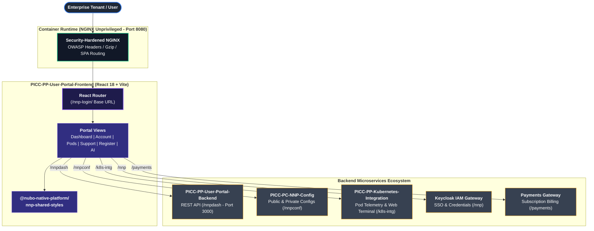

# PICC-PP-User-Portal-Frontend

[](https://opensource.org/licenses/Apache-2.0)
[](https://reactjs.org/)
[](https://www.typescriptlang.org/)
[](https://vitejs.dev/)
[](https://hub.docker.com/_/nginx)
[](.github/workflows/ci-cd.yml)

The **`PICC-PP-User-Portal-Frontend`** is the primary tenant and user-facing portal for the **Nubo Native Platform (NNP)**. Built on React 18, Vite, and TypeScript, it delivers self-service registration, subscription onboarding, cluster workload monitoring, Kubernetes pod terminal access, payment flows, customer support, and an AI-driven knowledge assistant.

---

## Architectural Overview



---

## Technology Matrix

| Category | Technology / Library | Version | Role / Description |
| :--- | :--- | :--- | :--- |
| **Framework** | React | `18.3.1` | Modern declarative UI component architecture |
| **Language** | TypeScript | `5.6.2` | Type-safe enterprise JavaScript superset |
| **Build Tool** | Vite | `6.0.5` | High-speed ESM-based frontend bundler |
| **Styling & Design Tokens** | `@nubo-native-platform/nnp-shared-styles` | `^1.1.7` | Shared cross-platform SCSS styles and UI design tokens |
| **CSS Framework** | Tailwind CSS | `4.1.11` | Utility-first responsive CSS styling |
| **Component UI** | Material UI (MUI) & X-DataGrid | `6.5.0` / `8.9.1` | Rich interactive tables, dialogues, and form components |
| **Data Visualization** | Apache ECharts & echarts-for-react | `5.6.0` / `3.0.3` | High-performance workload and consumption charts |
| **Icons** | Lucide React & MUI Icons | `0.545.0` / `6.4.1` | Scalable iconography system |
| **Runtime Container** | `nginxinc/nginx-unprivileged` | `1.27-alpine` | Non-root, hardened Alpine container runtime |

---

## Quick Start

### Prerequisites
- **Node.js**: `v20.x` or `v22.x` LTS
- **npm**: `v10.x` or higher
- **Docker** & **Docker Compose** (optional)

### 1. Clone & Configure
```bash
git clone https://github.com/Nubo-Native-Platform/PICC-PP-User-Portal-Frontend.git
cd PICC-PP-User-Portal-Frontend
cp .env.example .env
```

### 2. Install Dependencies
```bash
npm ci --legacy-peer-deps
```

### 3. Run Development Server
```bash
npm run dev
```
Open your browser at `http://localhost:3006/nnp-login/`.

### 4. Production Build & Linting
```bash
# Run lint check
npm run lint

# Compile TypeScript and build production bundle
npm run build
```

---

## Containerized Deployment

### Standalone Docker Execution
```bash
# Build multi-stage production container image
docker build -t picc-pp-user-portal-frontend:latest .

# Run unprivileged container on port 8080
docker run -d --name user-portal-frontend -p 8080:8080 picc-pp-user-portal-frontend:latest
```
Access the application at `http://localhost:8080/nnp-login/` (or check liveness at `http://localhost:8080/healthz`).

### Docker Compose
```bash
docker compose up -d
```

---

## Core Capabilities & Features

1. **Self-Service Registration & Onboarding**:
   - Multi-step account registration, category selection, and credential verification.
   - Integrated plan selection and subscription checkout flow.
2. **Interactive Tenant Dashboard**:
   - Live environment telemetry, service status tracking, and resource allocation graphs.
3. **Account & Infrastructure Management**:
   - User profile settings and Keycloak account synchronization.
   - Kubernetes Pod viewer with pod lifecycle management and integrated live web terminal.
4. **Support & Ticketing Center**:
   - Searchable ticket logs, issue creation, and platform knowledge base.
5. **AI Knowledge Assistant**:
   - Real-time streaming assistant (`SearchAi`) answering questions on platform capabilities, architectures, and operations.

---

## Environment Configuration Matrix

| Variable | Description | Safe Default |
| :--- | :--- | :--- |
| `PORT` | Container HTTP listen port | `8080` |
| `VITE_BASE_URL` | Base application routing prefix | `/nnp-login/` |
| `VITE_APP_DOMAIN` | Domain service endpoint | `http://localhost:3000/domain` |
| `VITE_DASH_HOST` | User dashboard service root | `http://localhost:3000/nnpdash` |
| `VITE_AUTH_HOST` | Authentication service root | `http://localhost:3000/nnp` |
| `VITE_NNP_CONFT` | Authenticated configuration API endpoint | `http://localhost:3000/nnpconf` |
| `VITE_NNP_CONFT_PUB`| Public metadata and registration endpoint | `http://localhost:3000/nnpconf-pub` |
| `VITE_API_GW_PUB` | Public API Gateway endpoint | `http://localhost:3000/api-gw-pub` |
| `VITE_API_PAYMENT` | Subscription payment gateway API | `http://localhost:3000/payments` |
| `VITE_API_KI` | Kubernetes Integration authenticated API | `http://localhost:3000/k8s-intg` |
| `VITE_API_KI_PUB` | Kubernetes Integration public API | `http://localhost:3000/k8s-intg-pub` |
| `VITE_API_QA` | AI streaming QA service endpoint | `http://localhost:3000` |
| `VITE_DOCS_URL` | Platform documentation URL | `https://docs.example.com/nnp-docs/` |
| `VITE_HOME_URL` | Home landing page URL | `/` |
| `VITE_KEYCLOAK_ACCOUNT_URL` | Keycloak account self-management portal | `https://keycloak.example.com/.../account` |
| `VITE_KEYCLOAK_RESET_CREDENTIALS_URL` | Keycloak password reset portal | `https://keycloak.example.com/.../reset-credentials` |
| `VITE_COOKIE_DOMAIN`| Session cookie domain scope | `.localhost` |
| `VITE_LOCALHOST` | Local development flag | `true` |
| `PRODUCTION` | Production optimization flag | `false` |

---

## Project Documentation

- [User Manual & Deployment Guide](USER_MANUAL_AND_DEPLOYMENT_GUIDE.md) — Comprehensive end-user workflows, Kubernetes manifests, and operations.
- [Development Guidelines](DEVELOPMENT_GUIDELINES.md) — Architectural standards, TypeScript conventions, and PR checklists.
- [Contributing Guide](CONTRIBUTING.md) — Contribution workflows and bug report policies.
- [Security Policy](SECURITY.md) — Responsible disclosure process and secret prevention standards.
- [Code of Conduct](CODE_OF_CONDUCT.md) — Community standards and contributor expectations.
- [Maintainers](MAINTAINERS.md) — Core platform maintainers and contact points.

---

## Repository Structure

```
.
├── .github/workflows/ci-cd.yml             # GitHub Actions CI/CD pipeline
├── .env.example                            # Configuration environment template
├── .gitattributes                          # Git normalization rules
├── .gitignore                              # Secret and build artifact exclusions
├── Dockerfile                              # Multi-stage unprivileged NGINX container
├── docker-compose.yml                      # Local multi-container Docker compose spec
├── default.conf                            # Security-hardened NGINX server configuration
├── package.json                            # Project metadata & npm dependencies
├── tsconfig.json                           # TypeScript compiler configuration
├── vite.config.ts                          # Vite bundling configuration
├── public/                                 # Static public assets
└── src/                                    # React TypeScript application source
    ├── assets/                             # Logos, graphics, icons
    ├── baseComponents/                     # Core layout components (Header, Footer, Modals)
    ├── components/                         # Feature components (Home, Account, Register, AI)
    ├── configs/                            # Router, menu, and layout configurations
    ├── containers/                         # Main page view containers
    ├── models/                             # TypeScript models and interfaces
    ├── services/                           # HTTP API clients and cookie services
    └── sharedComponents/                   # Reusable UI widgets and data grids
```

---

## Security & Governance

- **Zero Hardcoded Secrets**: Secrets, credentials, and internal hostnames are strictly excluded from source control.
- **OWASP Hardened NGINX**: The runtime web server enforces strict MIME types, anti-clickjacking headers, and XSS protection.
- **Rootless Execution**: Container processes run exclusively under non-root UID `101`.
- **Vulnerability Reporting**: Report security findings confidentially to **contribution@nubons.com**.

---

## Contributing

Contributions are welcomed under the **Apache-2.0 License**! Please consult [CONTRIBUTING.md](CONTRIBUTING.md) and [DEVELOPMENT_GUIDELINES.md](DEVELOPMENT_GUIDELINES.md) prior to submitting pull requests.

---

## License

Licensed under the **Apache License, Version 2.0** — see [LICENSE](LICENSE) for details.
