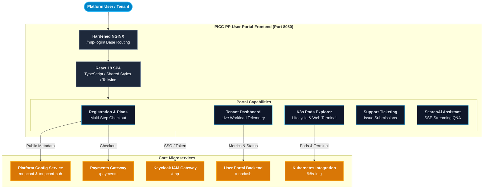

# User Manual and Deployment Guide: `PICC-PP-User-Portal-Frontend`

This document provides a comprehensive user manual, operations guide, and production deployment handbook for **`PICC-PP-User-Portal-Frontend`** within the **Nubo Native Platform (NNP)**.

---

## Table of Contents

1. [System Architecture & Portal Role](#1-system-architecture--portal-role)
2. [Prerequisites & System Requirements](#2-prerequisites--system-requirements)
3. [Configuration Reference & Environment Variables](#3-configuration-reference--environment-variables)
4. [User Modules & Portal Workflows](#4-user-modules--portal-workflows)
   - [Self-Service Tenant Registration & Plan Checkout](#self-service-tenant-registration--plan-checkout)
   - [Authentication & Single Sign-On (SSO)](#authentication--single-sign-on-sso)
   - [Tenant Dashboard & Resource Monitoring](#tenant-dashboard--resource-monitoring)
   - [Account Settings & Environment Features](#account-settings--environment-features)
   - [Kubernetes Pods Explorer & Live Web Terminal](#kubernetes-pods-explorer--live-web-terminal)
   - [Support Ticketing & Customer Service](#support-ticketing--customer-service)
   - [AI Knowledge Assistant (SearchAi)](#ai-knowledge-assistant-searchai)
5. [Local Build & Containerization](#5-local-build--containerization)
   - [Local Development Server](#local-development-server)
   - [Production Asset Compilation](#production-asset-compilation)
   - [Docker Container Build & Execution](#docker-container-build--execution)
   - [Docker Compose Local Deployment](#docker-compose-local-deployment)
6. [Production Deployment on Kubernetes](#6-production-deployment-on-kubernetes)
   - [Kubernetes Deployment & Service Manifest](#kubernetes-deployment--service-manifest)
   - [Ingress & Reverse Proxy Integration](#ingress--reverse-proxy-integration)
7. [Troubleshooting & Frequently Asked Questions](#7-troubleshooting--frequently-asked-questions)

---

## 1. System Architecture & Portal Role

`PICC-PP-User-Portal-Frontend` provides the primary interface for tenants, developers, and platform users across the Nubo Native Platform ecosystem.



---

## 2. Prerequisites & System Requirements

### Development Environment
- **Node.js**: `v20.x` or `v22.x` LTS
- **npm**: `v10.x` or higher
- **Modern Web Browser**: Chrome 110+, Firefox 110+, Safari 16+, Edge 110+

### Container Runtime Requirements
- **Docker Engine**: `v24.0+`
- **Kubernetes**: `v1.26+` (for production cluster deployment)
- **Minimum Memory**: 256 MiB RAM per container replica
- **Minimum CPU**: 100m vCPU per container replica

---

## 3. Configuration Reference & Environment Variables

All runtime settings are externalized using Vite environment variables (`import.meta.env`):

| Variable | Description | Default / Example |
| :--- | :--- | :--- |
| `PORT` | Container HTTP listen port | `8080` |
| `VITE_BASE_URL` | Base routing path for application assets | `/nnp-login/` |
| `VITE_APP_DOMAIN` | Domain service endpoint | `http://localhost:3000/domain` |
| `VITE_DASH_HOST` | User dashboard service root URL | `http://localhost:3000/nnpdash` |
| `VITE_AUTH_HOST` | Keycloak / Authentication gateway URL | `http://localhost:3000/nnp` |
| `VITE_NNP_CONFT` | Authenticated configuration API endpoint | `http://localhost:3000/nnpconf` |
| `VITE_NNP_CONFT_PUB`| Public configuration and registration API | `http://localhost:3000/nnpconf-pub` |
| `VITE_API_GW_PUB` | Public API Gateway endpoint | `http://localhost:3000/api-gw-pub` |
| `VITE_API_PAYMENT` | Subscription payment gateway API | `http://localhost:3000/payments` |
| `VITE_API_KI` | Kubernetes Integration authenticated API | `http://localhost:3000/k8s-intg` |
| `VITE_API_KI_PUB` | Kubernetes Integration public API | `http://localhost:3000/k8s-intg-pub` |
| `VITE_API_QA` | AI streaming Q&A service endpoint | `http://localhost:3000` |
| `VITE_DOCS_URL` | External documentation link | `https://docs.example.com/nnp-docs/` |
| `VITE_HOME_URL` | Portal home link destination | `/` |
| `VITE_KEYCLOAK_ACCOUNT_URL` | Keycloak account management page | `https://keycloak.example.com/.../account` |
| `VITE_KEYCLOAK_RESET_CREDENTIALS_URL` | Keycloak password reset link | `https://keycloak.example.com/.../reset-credentials` |
| `VITE_COOKIE_DOMAIN`| Scope for session cookies (`.localhost` or `.example.com`) | `.localhost` |
| `VITE_LOCALHOST` | Development localhost toggle | `true` |
| `PRODUCTION` | Production optimization flag | `false` |

---

## 4. User Modules & Portal Workflows

### Self-Service Tenant Registration & Plan Checkout
1. Navigate to `/register`.
2. Step 1: Input organization details, user name, email, and country.
3. Step 2: Choose your organization category and environment identifier.
4. Step 3: Select an appropriate subscription tier (Free, Starter, Pro, Enterprise).
5. Step 4: Review your quota limits and complete enrollment or payment checkout.

### Authentication & Single Sign-On (SSO)
- Click **Login** in the top navigation bar to open the modal dialogue.
- Enter credentials to receive scoped JWT session tokens.
- For forgotten passwords, click **Forgot Password** to redirect securely to the Keycloak credential reset flow.

### Tenant Dashboard & Resource Monitoring
- The dashboard displays real-time telemetry:
  - Active platform services and cluster status.
  - Resource usage charts (CPU, memory, storage) rendered with Apache ECharts.
  - Quick action links to account settings, Kubernetes pods, and support.

### Account Settings & Environment Features
- Manage user profile data, organization metadata, and environment features.
- Switch active environments seamlessly using the environment selector.
- Click **Manage Account** in the user dropdown to synchronize Keycloak account profile details.

### Kubernetes Pods Explorer & Live Web Terminal
- Inspect deployed containers within your tenant namespace.
- Filter pods by status (Running, Pending, Failed) and restart or delete non-responsive pods.
- Click **Terminal** on any active pod to open a secure in-browser interactive web shell session.

### Support Ticketing & Customer Service
- Create support inquiries with severity ratings, descriptions, and attachment links.
- Review status updates, historical resolution logs, and maintainer feedback.

### AI Knowledge Assistant (SearchAi)
- Interact with the real-time AI knowledge assistant.
- Streaming responses provide immediate answers on architecture, troubleshooting, and microservice configuration.

---

## 5. Local Build & Containerization

### Local Development Server
```bash
# Install dependencies
npm ci --legacy-peer-deps

# Start Vite dev server on port 3006
npm run dev
```

### Production Asset Compilation
```bash
# Type check and build bundle
npm run build
```
Compiled production files are generated into `./dist/`.

### Docker Container Build & Execution
```bash
# Build multi-stage production image
docker build -t picc-pp-user-portal-frontend:latest .

# Run unprivileged container on port 8080
docker run -d \
  --name user-portal-frontend \
  -p 8080:8080 \
  picc-pp-user-portal-frontend:latest
```

### Docker Compose Local Deployment
```bash
docker compose up -d
```

---

## 6. Production Deployment on Kubernetes

### Kubernetes Deployment & Service Manifest
Save the following manifest as `user-portal-frontend.yaml`:

```yaml
apiVersion: apps/v1
kind: Deployment
metadata:
  name: picc-pp-user-portal-frontend
  namespace: nnp-core-components
  labels:
    app.kubernetes.io/name: user-portal-frontend
    app.kubernetes.io/part-of: nubo-native-platform
spec:
  replicas: 2
  selector:
    matchLabels:
      app.kubernetes.io/name: user-portal-frontend
  template:
    metadata:
      labels:
        app.kubernetes.io/name: user-portal-frontend
    spec:
      securityContext:
        runAsNonRoot: true
        runAsUser: 101
        fsGroup: 101
      containers:
        - name: frontend
          image: ghcr.io/nubo-native-platform/picc-pp-user-portal-frontend:latest
          imagePullPolicy: IfNotPresent
          ports:
            - containerPort: 8080
              name: http
          livenessProbe:
            httpGet:
              path: /healthz
              port: 8080
            initialDelaySeconds: 10
            periodSeconds: 15
          readinessProbe:
            httpGet:
              path: /healthz
              port: 8080
            initialDelaySeconds: 5
            periodSeconds: 10
          resources:
            requests:
              cpu: 50m
              memory: 64Mi
            limits:
              cpu: 250m
              memory: 256Mi
---
apiVersion: v1
kind: Service
metadata:
  name: user-portal-frontend-svc
  namespace: nnp-core-components
spec:
  type: ClusterIP
  selector:
    app.kubernetes.io/name: user-portal-frontend
  ports:
    - port: 8080
      targetPort: 8080
      name: http
```

Deploy the application:
```bash
kubectl apply -f user-portal-frontend.yaml
```

### Ingress & Reverse Proxy Integration
To route external traffic to the user portal:

```yaml
apiVersion: networking.k8s.io/v1
kind: Ingress
metadata:
  name: user-portal-ingress
  namespace: nnp-core-components
  annotations:
    kubernetes.io/ingress.class: nginx
    nginx.ingress.kubernetes.io/proxy-body-size: "10m"
spec:
  rules:
    - host: portal.example.com
      http:
        paths:
          - path: /nnp-login
            pathType: Prefix
            backend:
              service:
                name: user-portal-frontend-svc
                port:
                  number: 8080
```

---

## 7. Troubleshooting & Frequently Asked Questions

### Blank Page After Deployment
- **Cause**: Assets requested under `/` instead of `/nnp-login/`.
- **Solution**: Confirm `VITE_BASE_URL=/nnp-login/` is defined at build time in Vite.

### Kubernetes Pod Web Terminal Fails to Connect
- **Cause**: Missing origin headers or blocked WebSocket proxying.
- **Solution**: Verify `VITE_API_KI` points to the reachable Kubernetes integration endpoint and WebSocket upgrade headers (`Upgrade $http_upgrade`, `Connection "upgrade"`) are enabled in the ingress reverse proxy.

### CORS Errors When Requesting Backend APIs
- **Cause**: Backend microservices rejecting frontend domain.
- **Solution**: Ensure your frontend hostname (`portal.example.com`) is added to the allowed CORS origins in `PICC-PP-User-Portal-Backend` and `PICC-PC-NNP-Config`.
